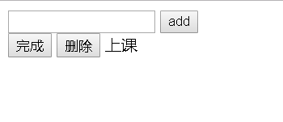
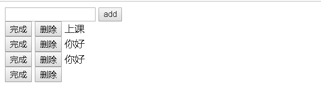
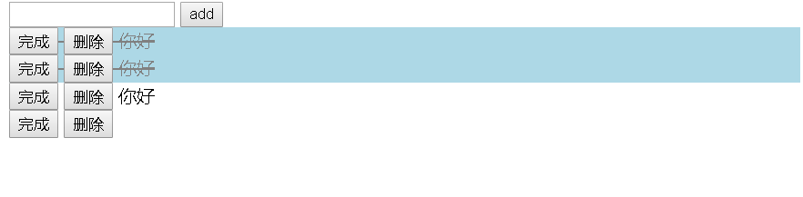
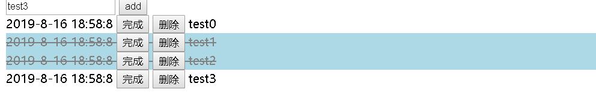

### 1

* 前期准备

  ```JavaScript
  //自己定义一个log函数
  var log = function () {
      console.log.apply(console, arguments)
  }
  
  // 文档对象模型Document引用的
  // querySelector()方法返回文档中与指定选择器或选择器组匹配的第一个 html元素Element。
  //  如果找不到匹配项，则返回null。
  var e = function (selector) {
      return document.querySelector(selector)
  }
  
  ```

  

* 创一个文本框和一个add按钮

  ```html
  <div>
      <input id='id-input-todo' type="text">
      <button id='id-button-add'>add</button>
  </div>
  ```

* 创建添加一个元素后的页面

  ```HTML
  <div id="id-div-container">
      <div>
          <button class="todo-done">完成</button>
          <button class="todo-delete">删除</button>
          <span class="todo-content" contenteditable="true">上课</span>
      </div>
  </div>
  
  <!-- 全局属性 contenteditable  是一个枚举属性，
                      表示元素是否可被用户编辑。 
                      如果可以，浏览器会修改元素的部件以允许编辑。 -->
  ```

  

### 2 

* 为add绑定事件

  ```javascript
  var addButton = e('#id-button-add')
  addButton.addEventListener('click', function () {
      var todoInput = e('#id-input-todo')
      var todo = todoInput.value
      var todoContainer = e('#id-div-container')
      var t = templateTodo(todo)
      todoContainer.insertAdjacentHTML('beforeend', t)
  
  })
  
  var templateTodo = function (todo) {
      vvar t = `
      <div>
          <button class="todo-done">完成</button>
          <button class="todo-delete">删除</button>
          <span class="todo-content" contenteditable="true">${todo}</span>
      </div>`
  
      return t;
  }
  ```

  

###   3

* 利用事件委托完成完成和删除功能

  ```javascript
  //事件委托:就是把一个元素响应事件（click、keydown......）的函数委托到另一个元素；
  // event.target 属性可以用来实现事件委托 (event delegation)。
  var todoContainer = e('#id-div-container')
  
  todoContainer.addEventListener('click', function (event) {
      var target = event.target
      if (target.classList.contains('todo-done')) {
          // target.parentElement 用来获取按钮的父节点
          // 给 todo div 开关一个状态 class
          var todoDiv = target.parentElement
  
          toggleClass(todoDiv, 'done')
      } else if (target.classList.contains('todo-delete')) {
          var todoDiv = target.parentElement
          todoDiv.remove()
      }
  
  })
  
  // 这个函数用来开关一个元素的某个 class
  var toggleClass = function (element, className) {
      // 检查元素是否拥有某个 class
      if (element.classList.contains(className)) {
          // 拥有则删除之
          element.classList.remove(className)
      } else {
          // 没有则加上
          element.classList.add(className)
      }
  }
  ```

  ```css
  .done {
      color: gray;
      text-decoration: line-through;
      background: lightblue;
  }
  ```

  

### 4 

* `用 localStorage 存储数据，使用JSON 序列化后，就可以把 todo 存入浏览器的 localStorage`

  ```JavaScript
  //定义一个函数，用于把数组写入 localStorage
  let save = function (array) {
      let s = JSON.stringify(array)//数组转字符串
      log('序列化后的字符串', typeof s, s)
      localStorage.todos = s
  }
  
  //读取localStorage中的数据并解析返回
  
  let load = function () {
      let s = localStorage.todos
      let a = JSON.parse(s)
      log('反序列化后的数组', typeof a, a)
      return a    //字符串转数组
  }
  
  
  //把页面上所有的 todo 用save 保存
  let saveTodos = function () {
      //选中所有的class为todo-content
      let contents = document.querySelectorAll('.todo-content')
      let todos = []
      for (let i = 0; i < contents.length; i++) {
          let element = contents[i];
          let statu = element.parentElement.classList.contains('done')
          let todo = {
              done: statu,
              content: element.innerHTML,
          }
          //添加到数组中
          todos.push(todo)
      }
      save(todos)
  }
  
  let loadTodos = function () {
      let todos = load()
      //每个div都插入
      for (let i = 0; i < todos.length; i++) {
          let todo = todos[i];
          inserTodo(todo.content, todo.done)
      }
  }
  
  //刷新自动装载
  loadTodos()
  ```

### 5 

* 添加时间

  ```javascript
  //得到当前的时间
  let now = function () {
      let d = new Date()
      let year = d.getFullYear()
      let month = d.getMonth() + 1
      let day = d.getDate()
      let hour = d.getHours()
      let minute = d.getMinutes()
      let second = d.getSeconds()
      return `${year}-${month}-${day} ${hour}:${minute}:${second}`
  }
  
  
  ```

* 修改插入函数和模板函数

  ```JavaScript
  let templateTodo = function (todo, statu, date) {
      log(date)
      let status = ''
      if (statu) {
          status = 'done'
      }
      let t = `
          <div class='todo-cell ${status}'>
              <span class="todo-time" >${date}</span>
              <button class="todo-done">完成</button>
              <button class="todo-delete">删除</button>
              <span class="todo-content" contenteditable="true">${todo}</span>
          </div>`
      return t;
  }
  
  let inserTodo = function (todo, statu, date) {
      let t = templateTodo(todo, statu, date)
      todoContainer.insertAdjacentHTML('beforeend', t)
      //insertAdjacentHTML() 将指定的文本解析为HTML或XML，并将结果节点插入到DOM树中的指定位置。
      //它不会重新解析它正在使用的元素，因此它不会破坏元素内的现有元素。
  
  }
  
  
  ```

  

* 刷新之后依然不变

